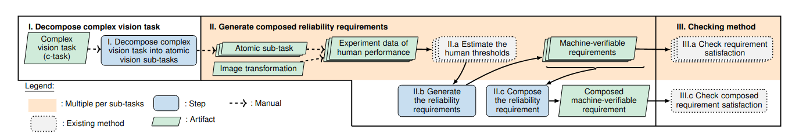

.. Object Detection documentation master file, created by
   sphinx-quickstart on Mon Aug 22 05:17:07 2022.
   You can adapt this file completely to your liking, but it should at least
   contain the root `toctree` directive.

Decompovision: Reliability Analysis of Machine Vision Components Through Decomposition and Reuse.
=================================================================================================

.. toctree::
   :maxdepth: 1
   :caption: Table of contents:

   source/envsetup
   source/proofs
   source/mturk
   source/requirements
   source/evaluation

On this website, we provide the supplementary material for our ICSE’2023 submission. 
The figure below gives an overview of our proposed DecompoVision framework.

  

Overview
--------
Based on our complex vision task decomposition, we develop a modular reliability framework DecompoVision (shown above), which builds on top of the state of the art reliability framework for image classfication [ICRAF]_.
Our framework decomposes a complex vision task (c-task) into atomic subtasks (Step I, see :ref:`Metric Decomposition`).
Then, for each subtask independently, given an image transformation simulating scene changes, we use human performance data to generate reliability requirements (Step II.a and II.b).
Consequently, we compose the individual subtask requirements to get the requirements for the c-task (Step II.c, see :ref:`Reliability Requirements`).
Finally, we propose a checking method for both the overall c-task and the subtask requirements, which enables *failure localization* in the sequence of subtasks.
Note that the modularity of Decompovision allows us to reuse human performance data, requirements specifications, and analysis artifacts for shared subtasks across different c-tasks.

This website contains:

1. Implementation of our framework and instructions for installing and running it: :ref:`Download DecompoVision`.
2. Definition of compound decomposable metrics and proofs for metrics decomposition: :ref:`Metric Decomposition`.
3. Experiments to collect human performance data, including instructions and data used in the paper: :ref:`Human Experiment`.
4. Proofs for correctness theorems: :ref:`Reliability Requirements`.
5. Additional evaluation results: :ref:`Additional Evaluation Results`.

..  [ICRAF] If a Human Can See It, So Should Your System: Reliability Requirements for Machine Vision Components `link <https://arxiv.org/abs/2202.03930/>`_.
