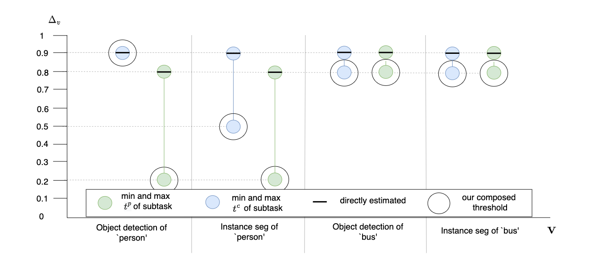
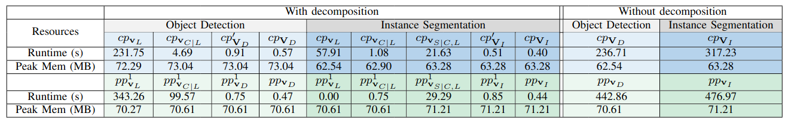

*****************************
Additional Evaluation Results
*****************************

In addition to the image transformation adding artificial frost shown in the paper, we also conducted an additional set of evaluation using the image transformation changing brightness. 
Because of page limit of the paper, we show them here.

RQ1
====
Comparison of the human tolerated threshold estimated either directly or by composing the subtask thresholds. :math:`t_{c}` and :math:`t_{p}` are for *correctness-preservation* (:math:`cp`) and *prediction-preservation* (:math:`pp`), respectively. 

As we can see in the image, our composed threshold is always the lowerbound threshold.

RQ2
===
In the following table, we have for the transformation changing brightness, and for the class bus, the comparison of reliability evaluation of object detection and instance segmentation MVCs with our checking method using the SoTa benchmark dataset PASCAL VOC-C [PASCALVOC-C]_.

.. image:: images/rq2b.png
  :alt: RQ2 table with brightness

RQ3
===
In the folowing table, we compare the average runtime and peak memory used to check the satisfaction of requirements against the image transformation changing brightness for object detection and instance segmentation W/O reusing decomposition analysis results.

Similar to results shown in the paper for the transformation adding artificial frost, we can see on the above table that the peak memory is not affected significantly. In total, checking :math:`cp` satisfaction for instance segmentation  by reusing results from object detection took :math:`81.53` seconds while checking without reuse took :math:`317.23` seconds; checking :math:`pp` took :math:`31.33` seconds with reuse and :math:`476.97` seconds without.
On average, reuse decreased runtime by :math:`86\%`, supporting our conclusion for RQ3. 

..  [PASCALVOC-C] Benchmarking Robustness in Object Detection: Autonomous Driving when Winter is Coming `link <https://arxiv.org/abs/1907.07484>`_.
