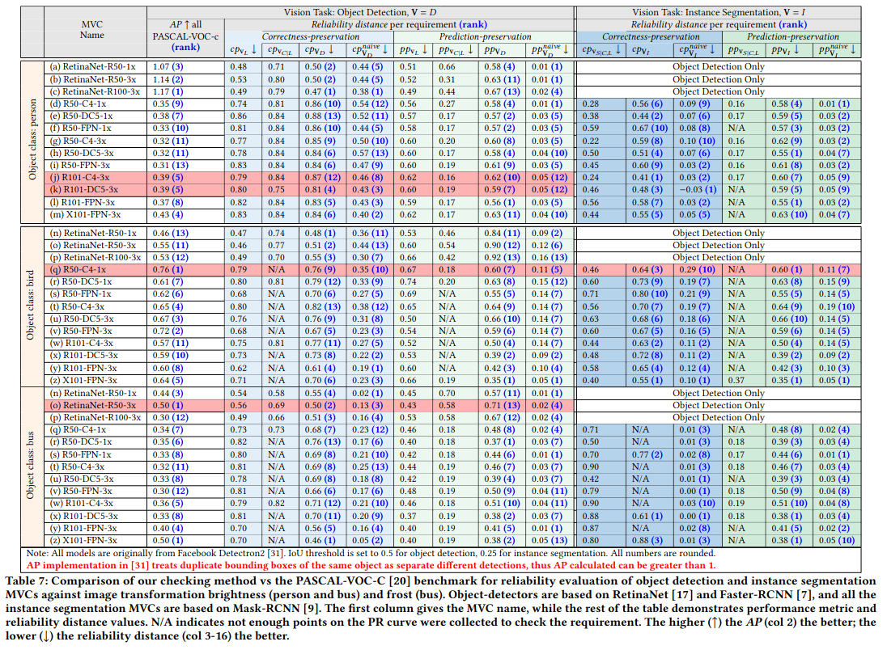

*****************************
Additional Evaluation Results
*****************************

In addition to the image transformation adding artificial frost shown in the paper, we also conducted an additional set of evaluation using the image transformation changing brightness, we also conducted a set of evaluation for the class bus. 
Because of page limit of the paper, we show them here.

RQ1
====
Comparison of the human tolerated threshold estimated either directly or by composing the subtask thresholds. :math:`t_{c}` and :math:`t_{p}` are for *correctness-preservation* (:math:`cp`) and *prediction-preservation* (:math:`pp`), respectively. 

.. image:: images/RQ1_brightness.png
  :alt: results for RQ1 specific to brightness

As we can see in the image, our composed threshold is always the lowerbound threshold.

RQ2
===
In the following table, we have for the transformation changing brightness, and for the class bus, the comparison of reliability evaluation of object detection and instance segmentation MVCs with our checking method using the SoTa benchmark dataset PASCAL VOC-C [PASCALVOC-C]_.

..  [PASCALVOC-C] Benchmarking Robustness in Object Detection: Autonomous Driving when Winter is Coming `link <https://arxiv.org/abs/1907.07484>`_.
