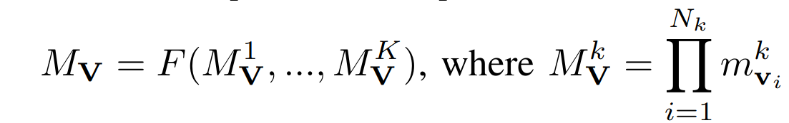

******************
Metric Decomposition
******************

In this page, we first provide the proof for the metric decomposition used in the paper, and we define Compound Decomposable Metrics for more complex metrics.

Decomposable Metrics
====================
Below, for a complex vision task, :math:`\mathbf{V}`, that can be represented as a sequential composition of  the subtasks, i.e., :math:`\mathbf{V} = \mathbf{v}_n \odot ...\mathbf{v}_2 \odot \mathbf{v}_1`, we remind the metric compositionality definition.

.. image:: images/decompometric.png
  :alt: decomposable metric
  
where :math:`M^{'}_\mathbf{V}` is a directly decomposable metric of the task :math:`\mathbf{V}`, :math:`m_{\mathbf{v}_i}` is a metric of the *i*-th subtask, and :math:`F` is a monotonic function.

Performance metric *AP*
=======================
The performance of an MVC or a human on a given vision task is usually evaluated using task-specific performance metrics. For the complex vision tasks object detection (:math:`\mathbf{V}_D`) and instance segmentation (:math:`\mathbf{V}_I`) used in the paper, a commonly used performance metric is Average \textit{Precision} (*AP*) measured for each object class. Each *AP* of a class is calculated by taking the area under the curve (AuC) of a *Precision*-*Recall* curve (*PR*-curve). The *PR*-curve is obtained as follows. For each :math:`\delta\in[0, 1]`, first collect all output bounding boxes with confidence score below :math:`\delta`; then calculate the precision of these boxes as :math:`\frac{TP}{TP+FP}` and recall as :math:`\frac{TP}{TP+FN}`, where *TP* is true positive, *FP* is false positive and *FN* is false negative.  Finally, each pair of (precision, recall) value becomes a point on the *PR*-curve. A threshold of intersection over union (IoU), usually predefined (e.g., :math:`0.5`), is used to determine whether the predicted boundary of the object overlaps with the ground truth enough to be considered a true positive over a false positive. For example, for a predicted bounding box of a bus :math:`b` and a ground truth bounding box :math:`b_0`, :math:`b` is considered a true positive if :math:`IoU(b, b_0) \geq 0.5` and false positive otherwise. However, calculating precision and recall for each :math:`\delta\in[0, 1]` can be expensive; therefore, in practice, a :math:`\delta` value is only selected if there exists at least one bounding box with the confidence score that equals to :math:`\delta`. 
The procedure for calculating *AP* for instance segmentation is the same as that for object detection, except each point on the *PR*-curve is obtained with precision and recall values with the areas enclosed in the outlines rather than bounding boxes.

Decomposition of *AP*
=====================
Below, we show that *AP* is decomposable.
First, *AP* for a class :math:`c` is the AuC of the *PR*-curve. Therefore, by the definition of decomposable metrics, if each *PR*-curve is directly decomposable, *AP* is decomposable. Each point on the *PR*-curve is defined with precision and recall for a class label :math:`c` given a :math:`\delta` and a IoU threshold :math:`t_{IoU}`. For object detection, for all detected objects :math:`d` such that the confidence score *conf*:math:`_d \geq \delta`, where :math:`c^*` represents the ground truth class and :math:`IoU_d` is the max :math:`IoU` of the bounding box compared to all ground truth boxes, we can represent *Precision* and *Recall* as: *Precision*:math:`^{\delta} = \frac{|\{d|IoU_d \geq t_{IoU}\land c_d = c^*\}|}{|\{d|c_d = c\}|}`     *Recall*:math:`^{\delta} = \frac{|\{d|IoU_d \geq t_{IoU} \land c_d = c^*\}|}{\{d|c^* = c\}|}` .

Thus, *Precision*:math:`^{\delta}` and *Recall*:math:`^{\delta}` can be decomposed as follows:

*Precision*:math:`^{\delta} =` :math:`\frac{|\{d|IoU_d \geq t_{IoU}\land c_d = c^* \land c_d = c\}|}{|\{d|c_d = c\}|} =`  
:math:`\frac{|\{d|c_d = c^* \land IoU_d \geq t_{IoU} \land c_d = c\}|}{|\{d|IoU_d \geq t_{IoU}\land c_d = c\}|} \cdot \frac{|\{d|IoU_d \geq t_{IoU}\land c_d = c\}|}{|\{d|c_d = c\}|}`                            
:math:`=` *Precision*:math:`_{L}^{\delta} \cdot` *Precision*:math:`_{C|L}^{\delta}`

*Recall*:math:`^{\delta} =` :math:`\frac{|\{d|IoU_d \geq t_{IoU}\land c_d = c^* \land c^* = c\}|}{|\{d|c^* = c\}|} =` 
:math:`\frac{|\{d|c_d = c^* \land IoU_d \geq t_{IoU}\land c^* = c\}|}{|\{d|IoU_d \geq t_{IoU}\land c^* = c\}|} \cdot \frac{|\{d|IoU_d \geq t_{IoU}\land c^* = c\}|}{|\{d|c^* = c\}|}`
:math:`=` *Recall*:math:`_{L}^{\delta} \cdot` *Recall*:math:`_{C|L}^{\delta}`

Note that :math:`IoU_d \geq t_{IoU} \land c_d = c^*` is the condition for a detection :math:`d` to be a true positive. 
We can see that for *Precision*:math:`^{\delta}`, :math:`\frac{|\{d|IoU_d \geq t_{IoU}\land c_d = c\}|}{|\{d|c_d = c\}|}` is the percentage of bounding boxes matched ground truth out of all output boxes of this class, which is precision for :math:`\mathbf{v}_L`; :math:`\frac{|\{d|c_d = c^* \land IoU_d \geq t_{IoU} \land c_d = c\}|}{|\{d|IoU_d \geq t_{IoU}\land c_d = c\}|}` is the percentage of correct labels out of all bounding boxes matched ground truth of this class, which is precision for :math:`\mathbf{v}_{C|L}`. Similarly for *Recall*:math:`^{\delta}`, :math:`\frac{|\{d|IoU_d \geq t_{IoU}\land c^* = c\}|}{|\{d|c^* = c\}|}` is recall for :math:`\mathbf{v}_L` and :math:`\frac{|\{d|IoU_d \geq t_{IoU}\land c^* = c\}|}{|\{d|c^* = c\}|}` is recall for :math:`\mathbf{v}_{C|L}`. Since both *Precision*:math:`^{\delta}` and *Recall*:math:`^{\delta}` are decomposable, each point on the *PR*-curve is decomposable, the *PR*-curve for each class :math:`c` can be decomposed into the two subtasks, i.e., *PR*:math:`_D =` *PR*:math:`_L \cdot \textit{PR}_{C|L}`. As a result, *AP* for object detection is decomposable following :ref:`Metric Decomposition`. 

Compound Decomposable Metrics
=============================
Some metrics, such as mean Average *Precision* (*mAP*), are more complex and are not decomposable according to our decomposition definition. *mAP* is defined as an average of *AP* for each class label *c*; therefore, *mAP* can be represented as a function of the precision-recall curve, *PR*, that is directly decomposable. 
For such metrics :math:`M_\mathbf{V}`, we extend the *decomposable metric* definition into *compound decomposable* as follows:

where :math:`M_\mathbf{V}^k` is a decomposable metric of the task :math:`\mathbf{V}`, :math:`m^k_{\mathbf{v}_i}` is a metric of the *i*-th subtask, and :math:`F` is a function that is monotonic with respect to every argument.

Please find here (TODO:LINK) the proof that the object detection metric *mAP* is decomposable.

