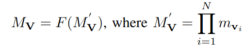

******************
Task Decomposition
******************

In this page, we first provide the proof for the metric decomposition used in the paper, and we explain how to decompose complex metrics.

Metric Decomposition
====================
Below, for a complex vision task, :math:`\mathbf{V}`, that can be represented as a sequential composition of  the subtasks, i.e., :math:`\mathbf{V} = \mathbf{v}_n \odot ...\mathbf{v}_2 \odot \mathbf{v}_1`, we remind the metric compositionality definition.

  
where :math:`M^{'}_\mathbf{V}` is a directly decomposable metric of the task :math:`\mathbf{V}`, :math:`m_{\mathbf{v}_i}` is a metric of the *i*-th subtask, and :math:`F` is a monotonic function.

TODO add link to Proof for only 1 k

Complex Metric Decompositon
===========================
Some metrics, such as mean Average *Precision* (*mAP*), are more complex and are not decomposable according to our decomposition definition. *mAP* is defined as an average of *AP* for each class label *c*; therefore, *mAP* can be represented as a function of the precision-recall curve, *PR*, that is directly decomposable. 
For such metrics :math:`M_\mathbf{V}`, we extend the *decomposable metric}* definition into *compound decomposable* as follows:

.. image:: images/compoundmetric.png
  :alt: compound metric

where :math:`M_\mathbf{V}^k` is a decomposable metric of the task math:`\mathbf{V}`, :math:`m^k_{\mathbf{v}_i}` is a metric of the *i*-th subtask, and :math:`F` is a function that is monotonic with respect to every argument.

