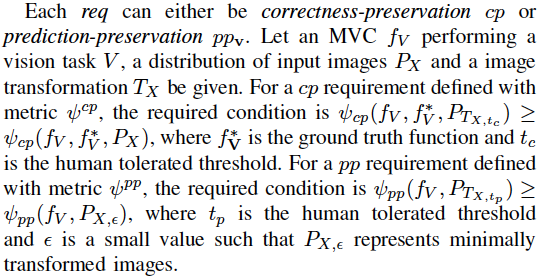
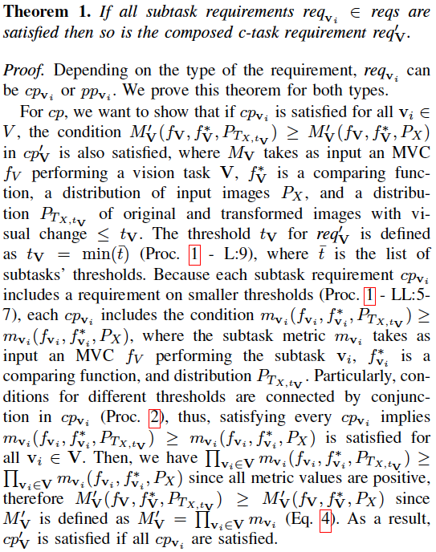
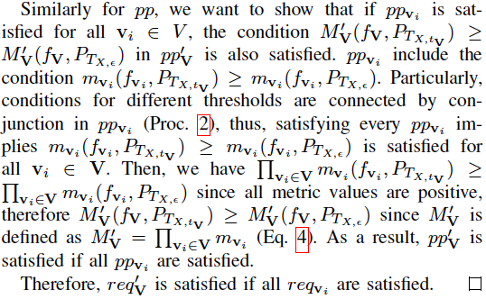
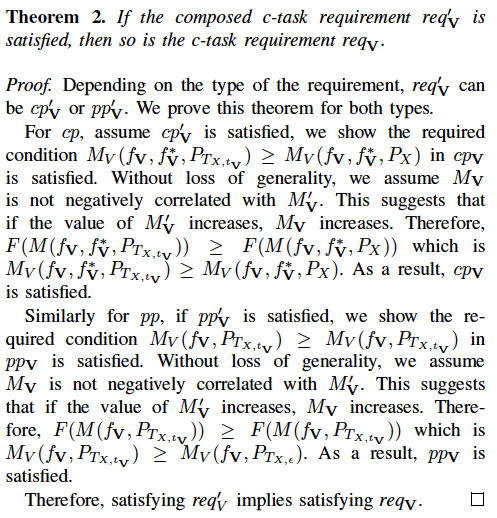
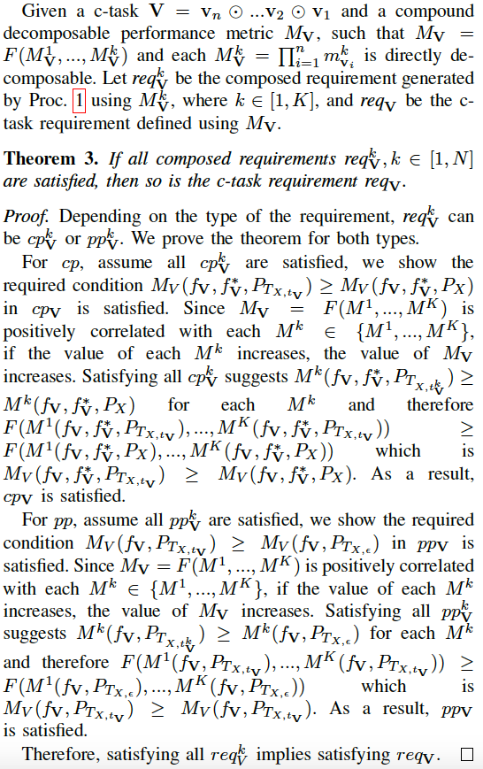

************************
Reliability Requirements
************************

In this page, we first provide more details on the parameter estimation method, then the proof of the Theorem 1 and Theorem 2, and finally, we show how Procedure 1 can be adapted for compound decomposable evaluation metrics, such as *mAP*. 

Parameter Estimation
====================
To generate reliability requirements for c-tasks, Procedure 1 takes a list of estimated threshold values (:math:`t_c, t_p`) for each subtask :math:`\mathbf{v}_i` from the human performance data.
The thresholds are estimated following ICRAF estimation method.
Specifically, we begin with an estimation of the threshold values (:math:`t_c, t_p`) for each subtask :math:`v_i` from the human performance data, following the state-of-the-art estimation method (see Section Background).
To compute the human-tolerated range of visual changes, state-of-the-art uses the binomial statistical test, which is specific to the task metric. 
E.g., for the metric Precision-Recall curve :math:`PR` (used for object detection and instance segmentation), obtained with the human experiment data, the binomial test is performed on each point of the curve, checking if :math:`PR` for transformed images is below that of the original images with sufficient statistical significance.
Since in the empirical studies one does not have the data of all the points of the :math:`PR` curve, the binomial test is performed only in the curve locations where sufficient data is available. 
To define binomial test in a point of a :math:`PR` curve, we need to define two binomial tests, for precision and recall at that point, respectively.
Specifically, for each individual binomial test, we follow the procedure of state-of-the-art to estimate the human-tolerated range of visual changes, :math:`\Delta_v` (see Section Background), and pick the minimum range for the :math:`PR` curve binomial test, i.e., :math:`\Delta^{PR}_v = min{(\Delta^{prec}_v, \Delta^{rec}_v})`.
The resulting :math:`t_c` and :math:`t_p` thresholds for the entire :math:`PR` curve are obtained by considering the visual change :math:`\Delta^{PR}_v` value at the curve point that has been obtained with the largest amount of human data.

Although not shown in the paper, we also conducted experiments with the transformation brightness and obtained thresholds shown below:

.. image:: images/brightness_thresholds.png
  :alt: thresholds estimated for brightness

Correctness of our requirement composition
==========================================
Given a  c-task :math:`\mathbf{V} = \mathbf{v}_n \odot ...\mathbf{v}_2 \odot \mathbf{v}_1` and a decomposable performance metric :math:`M_\mathbf{V}`, such that :math:`M_\mathbf{V} = F(M'_\mathbf{V})` and :math:`M'_\mathbf{V} = \prod_{i=1}^n m_{\mathbf{v}_i}`,  let :math:`\textit{reqs}=\{\textit{req}_{\mathbf{v}_1}, ..., \textit{req}_{\mathbf{v}_n}\}` be the list of subtask requirements generated by Procedure 1, where :math:`\textit{req}_{\mathbf{v}_i}` is defined with :math:`m_{\mathbf{v}_i}`. Let :math:`\textit{req}'_\mathbf{V}` be the composed c-task requirement defined using :math:`M'_\mathbf{V}`, and :math:`\textit{req}_\mathbf{V}` be the c-task requirement defined using :math:`M_\mathbf{V}`. 

**Theorem 1** states that if an MVC satisfies all subtask requirements (:math:`\textit{req}_{\mathbf{v}_i} \in \textit{reqs}`), then the MVC also satisfies the composed c-task requirement :math:`\textit{req}'_\mathbf{V}`.

**Theorem 2** states that if an MVC satisfies the composed c-task requirement :math:`\textit{req}'_\mathbf{V}`, then the MVC also satisfies the c-task requirement  :math:`\textit{req}_\mathbf{V}`.

Proof of **Theorem 1**
----------------------

Proof of **Theorem 2**
----------------------

Procedure for Compound Decomposable Metrics
===========================================

We provide the following Procedure 3 for generating the reliability requirements for
the c-task :math:`\mathbf{V}` and its subtasks using the compound decomposable metrics :math:`M^k_\mathbf{V}` (see see :ref:`Metric Decomposition`). Note that the difference with Procedure 1 are highlighted in purple.

.. image:: images/proc3.png
  :width: 600
  :alt: Procedure for Complex Metrics

See the table above for examples of generated *correctness-preservation* requirements with compound decomposable metrics.

.. image:: images/reqcompo.png
  :alt: Example requirements with complex metrics

For the correctness of the requirement composition using the *compound decomposable metrics*, we prove the following theorem. 

