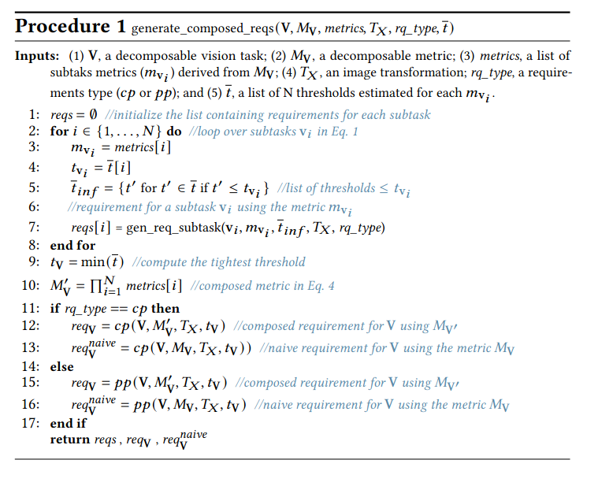
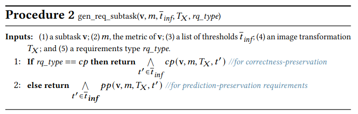

************************
Reliability Requirements
************************

In this page, we first provide more details on the parameter estimation method, then to make the page self contain we remind our procedures 1 and 2 used to generate the requirements, next we provide the proof of the Theorem 1, and finally, we show how :ref:`Procedure 1` can be adapted for compound decomposable evaluation metrics, such as *mAP*. 

Parameter Estimation
====================
To generate reliability requirements for c-tasks, :ref:`Procedure 1` takes a list of estimated threshold values (:math:`t_c, t_p`) for each subtask :math:`\mathbf{v}_i` from the human performance data.
The thresholds are estimated following ICRAF estimation method.
Specifically, we begin with an estimation of the threshold values (:math:`t_c, t_p`) for each subtask :math:`v_i` from the human performance data, following the state-of-the-art estimation method (see Section Background).
To compute the human-tolerated range of visual changes, state-of-the-art uses the binomial statistical test, which is specific to the task metric. 
E.g., for the metric Precision-Recall curve :math:`PR` (used for object detection and instance segmentation), obtained with the human experiment data, the binomial test is performed on each point of the curve, checking if :math:`PR` for transformed images is below that of the original images with sufficient statistical significance.
Since in the empirical studies one does not have the data of all the points of the :math:`PR` curve, the binomial test is performed only in the curve locations where sufficient data is available. 
To define binomial test in a point of a :math:`PR` curve, we need to define two binomial tests, for precision and recall at that point, respectively.
Specifically, for each individual binomial test, we follow the procedure of state-of-the-art to estimate the human-tolerated range of visual changes, :math:`\Delta_v` (see Section Background), and pick the minimum range for the :math:`PR` curve binomial test, i.e., :math:`\Delta^{PR}_v = min{(\Delta^{prec}_v, \Delta^{rec}_v})`.
The resulting :math:`t_c` and :math:`t_p` thresholds for the entire :math:`PR` curve are obtained by considering the visual change :math:`\Delta^{PR}_v` value at the curve point that has been obtained with the largest amount of human data.

Although not shown in the paper, we also conducted experiments with the transformation brightness and obtained thresholds shown below:

  

Procedure 1
===========

Procedure 2
===========

Correctness of our requirement composition
==========================================
Given a  c-task :math:`\mathbf{V} = \mathbf{v}_n \odot ...\mathbf{v}_2 \odot \mathbf{v}_1` and a decomposable performance metric :math:`M_\mathbf{V}`, such that :math:`M_\mathbf{V} = F(M'_\mathbf{V})` and :math:`M'_\mathbf{V} = \prod_{i=1}^n m_{\mathbf{v}_i}`,  let *reqs*:math:`=\{`*req*_{\mathbf{v}_1}, ...,` *req*:math:`_{\mathbf{v}_n}\}` be the list of subtask requirements generated by :ref:`Procedure 1`, where *req*:math:`_{\mathbf{v}_i}` is defined with :math:`m_{\mathbf{v}_i}`. Let *req*:math:`_\mathbf{V}` be the composed c-task requirement defined using :math:`M'_\mathbf{V}`. 
The theorem states that if an MVC satisfies subtask requirements *reqs*, it also satisfies c-task composed requirements *req*:math:_\mathbf{V}`.

Each *req* can either be *correctness-preservation* (*cp*) or *prediction-preservation* (:math:`pp`).  Let an MVC :math:`f_V` performing a vision task :math:`\mathbf{V}`, a distribution of input images :math:`P_X` and a image transformation :math:`T_X` be given. For a :math:`cp` requirement defined with a metric :math:`\psi^{cp}`, the required condition is :math:`\psi_{cp}( f_V , f_V^*, P_{T_{X,t_c}})\geq \psi_{cp}(f_V,f_V^*,P_X)`, where :math:`f_\mathbf{V}^*` is the ground truth function and :math:`t_c` is the human tolerated threshold. For a :math:`pp` requirement defined with metric :math:`\psi^{pp}`, the required condition is :math:`\psi_{pp}(f_V, P_{T_{X,t_p}})\geq \psi_{pp}(f_V,P_{X,\epsilon})`, where :math:`t_p` is the human-tolerated threshold and :math:`\epsilon` is a small value such that :math:`P_{X,\epsilon}` represents minimally transformed images. 

Theorem 1
~~~~~~~~~

**Theorem 1**: *If all subtask requirements* *req*:math:`_{\mathbf{v}_i} \in \textit{reqs}` *are satisfied  then so is the composed c-task requirement req*:math:`_{\mathbf{V}}`.

**Proof.**
Depending on the type of the requirement, *req*:math:`_{\mathbf{v}_i}` can be :math:`cp_{\mathbf{v}_i}` or :math:`pp_{\mathbf{v}_i}`. We prove this theorem for both types. 

For :math:`cp`, we want to show that if :math:`cp_{\mathbf{v}_i}` is satisfied for all :math:`\mathbf{v}_i \in V`, the condition :math:`M'_\mathbf{V}(f_\mathbf{V}, f_\mathbf{V}^*, P_{T_{X,t_\mathbf{V}}}) \geq M'_\mathbf{V}(f_\mathbf{V},f_\mathbf{V}^*,P_X)` in :math:`cp'_{\mathbf{V}}` is also satisfied, where :math:`M_\mathbf{V}` takes as input an MVC :math:`f_V` performing a vision task :math:`\mathbf{V}`, :math:`f_\mathbf{V}^*` is a comparing function, a distribution of input images :math:`P_X`, and a distribution :math:`P_{T_{X,t_\mathbf{V}}}` of original and transformed images with visual change :math:`\leq t_\mathbf{V}`.  
The threshold :math:`t_\mathbf{V}` for *req*:math:`_{\mathbf{V}}` is defined as :math:`t_{\mathbf{V}} = \min(\bar{t})` (:ref:`Procedure 1`,L:9), where :math:`\bar{t}` is the list of subtasks' thresholds. 
Because each subtask requirement :math:`cp_{\mathbf{v}_i}` includes a requirement on smaller thresholds (:ref:`Procedure 1`,LL:5-7), each :math:`cp_{\mathbf{v}_i}` includes the condition :math:`m_{\mathbf{v}_i}(f_{\mathbf{v}_i}, f_{\mathbf{v}_i}^*, P_{T_{X,t_\mathbf{V}}}) \geq m_{\mathbf{v}_i}(f_{\mathbf{v}_i},f_{\mathbf{v}_i}^*,P_X)`, where the subtask metric :math:`m_{\mathbf{v}_i}` takes as input an MVC :math:`f_V` performing the subtask :math:`\mathbf{v}_i`, :math:`f_{\mathbf{v}_i}^*` is a comparing function, and distribution :math:`P_{T_{X,t_\mathbf{V}}}`.     
Specifically, conditions for different thresholds are connected by conjunction in :math:`cp_{\mathbf{v}_i}` (:ref:`Procedure 1`), thus, satisfying every :math:`cp_{\mathbf{v}_i}` implies :math:`m_{\mathbf{v}_i}(f_{\mathbf{v}_i}, f_{\mathbf{v}_i}^*, P_{T_{X,t_\mathbf{V}}}) \geq m_{\mathbf{v}_i}(f_{\mathbf{v}_i},f_{\mathbf{v}_i}^*,P_X)` is satisfied for all :math:`{\mathbf{v}_i} \in \mathbf{V}`. 
Then, we have :math:`\prod_{{\mathbf{v}_i} \in \mathbf{V}} m_{\mathbf{v}_i}(f_{\mathbf{v}_i}, f_{\mathbf{v}_i}^*, P_{T_{X,t_\mathbf{V}}})  \geq \prod_{{\mathbf{v}_i} \in \mathbf{V}} m_{\mathbf{v}_i}(f_{\mathbf{v}_i}, f_{\mathbf{v}_i}^*, P_X)` since all metric values are positive; therefore, :math:`M'_\mathbf{V}(f_\mathbf{V}, f_\mathbf{V}^*, P_{T_{X,t_\mathbf{V}}}) \geq M'_\mathbf{V}(f_\mathbf{V},f_\mathbf{V}^*,P_X)` since :math:`M'_\mathbf{V}$ is defined as $M'_\mathbf{V} = \prod_{{\mathbf{v}_i} \in \mathbf{V}} m_{\mathbf{v}_i}` (see :ref:`Metric Decomposition`).  
As a result, :math:`cp'_{\mathbf{V}}` is satisfied if all :math:`cp_{\mathbf{v}_i}` are satisfied.

Similarly for :math:`pp`, we want to show that if :math:`pp_{\mathbf{v}_i}` is satisfied for all :math:`\mathbf{v}_i \in V`, the condition :math:`M'_\mathbf{V}(f_\mathbf{V}, P_{T_{X,t_\mathbf{V}}}) \geq M'_\mathbf{V}(f_\mathbf{V},P_{T_{X,\epsilon}})` in :math:`pp'_{\mathbf{V}}` is also satisfied.
:math:`pp_{\mathbf{v}_i}` include the condition :math:`m_{\mathbf{v}_i}(f_{\mathbf{v}_i}, P_{T_{X,t_\mathbf{V}}}) \geq m_{\mathbf{v}_i}(f_{\mathbf{v}_i},P_{T_{X,\epsilon}})`.
Specifically, conditions for different thresholds are connected by a conjunction in :math:`pp_{\mathbf{v}_i}` (see :ref:`Procedure 2`); thus, satisfying every :math:`pp_{\mathbf{v}_i}` implies :math:`m_{\mathbf{v}_i}(f_{\mathbf{v}_i}, P_{T_{X,t_\mathbf{V}}}) \geq m_{\mathbf{v}_i}(f_{\mathbf{v}_i},P_{T_{X,\epsilon}})` is satisfied for all :math:`{\mathbf{v}_i} \in \mathbf{V}`. 
Then, we have :math:`\prod_{{\mathbf{v}_i} \in \mathbf{V}} m_{\mathbf{v}_i}(f_{\mathbf{v}_i}, P_{T_{X,t_\mathbf{V}}}) \geq \prod_{{\mathbf{v}_i} \in \mathbf{V}} m_{\mathbf{v}_i}(f_{\mathbf{v}_i}, P_{T_{X,\epsilon}})` since all metric values are positive; therefore, :math:`M'_\mathbf{V}(f_\mathbf{V}, P_{T_{X,t_\mathbf{V}}}) \geq M'_\mathbf{V}(f_\mathbf{V},P_{T_{X,\epsilon}})` since :math:`M'_\mathbf{V}` is defined as :math:`M'_\mathbf{V} = \prod_{{\mathbf{v}_i} \in \mathbf{V}} m_{\mathbf{v}_i}` (see :ref:`Metric Decomposition`).  
As a result, :math:`pp'_{\mathbf{V}}` is satisfied if all :math:`pp_{\mathbf{v}_i}` are satisfied.

Therefore, *req*:math:`_{\mathbf{V}}` is satisfied if all *req*:math:`_{\mathbf{v}_i}` are satisfied.

Procedure for Compound Decomposable Metrics
===========================================

We provide the following Procedure 3 for generating the reliability requirements for
the c-task :math:`\mathbf{V}` and its subtasks using the compound decomposable metrics :math:`M^k_\mathbf{V}` (see :ref:`Metric Decomposition`). Note that the difference with :ref:`Procedure 1` are highlighted in purple.

See the table above for examples of generated *correctness-preservation* requirements with compound decomposable metrics.

.. image:: images/reqcompo.png
  :alt: Example requirements with complex metrics
  
For the correctness of the requirement composition using the *compound decomposable metrics*, we prove the following theorem. 
  
  
Theorem 2
~~~~~~~~~

**Theorem 2**: 
*Let* :math:`\mathbf{V}` *be a  c-task* :math:`\mathbf{V}= \mathbf{v}_n \odot ...\mathbf{v}_2 \odot \mathbf{v}_1` *and a*  :math:`M_\mathbf{V}` *be a compound decomposable performance metric, such that* :math:`M_\mathbf{V} = F(M^1_\mathbf{V}, ..., M^k_\mathbf{V})` *and each* :math:`M^k_\mathbf{V} = \prod_{i=1}^n m^k_{\mathbf{v}_i}` *is directly decomposable.* 
*Let req*:math:`^k_\mathbf{V}` *be the composed requirement generated by* :ref:`Procedure for Compound Decomposable Metrics` *using* :math:`M^k_\mathbf{V}`, where :math:`k \in [1, K]`, *and  req*:math:`_\mathbf{V}` *be the c-task requirement defined using* :math:`M_\mathbf{V}`.
*If all composed requirements req*:math:`^k_\mathbf{V}, k \in [1, N]` *are satisfied, then so is the c-task requirement req*:math:`_\mathbf{V}`.

**Proof.**
Depending on the type of the requirement, *req*:math:`^k_{\mathbf{V}}` can be :math:`cp^k_{\mathbf{V}}` or :math:`pp^k_{\mathbf{V}}`. We prove the theorem for both types. 

For :math:`cp`, assume all :math:`cp_{\mathbf{V}}^k` are satisfied.  We show the required condition :math:`M_V( f_\mathbf{V} , f_\mathbf{V}^*, P_{T_{X,t_\mathbf{V}}}) \geq M_V(f_\mathbf{V},f_\mathbf{V}^*,P_X)` in :math:`cp_{\mathbf{V}}` is satisfied.
Since :math:`M_\mathbf{V} = F(M^1, ..., M^K)` is positively correlated with each :math:`M^k \in \{M^1, ..., M^K\}`, if the value of each :math:`M^k` increases, the value of :math:`M_\mathbf{V}` increases as well. Satisfying all :math:`cp_{\mathbf{V}}^k` suggests :math:`M^k( f_\mathbf{V} , f_\mathbf{V}^*, P_{T_{X,t_\mathbf{V}^k}}) \geq M^k(f_\mathbf{V},f_\mathbf{V}^*,P_X)` for each :math:`M^k` and therefore, :math:`F(M^1( f_\mathbf{V} , f_\mathbf{V}^*, P_{T_{X,t_\mathbf{V}}}), ..., M^K( f_\mathbf{V} , f_\mathbf{V}^*, P_{T_{X,t_\mathbf{V}}})) \geq F(M^1(f_\mathbf{V},f_\mathbf{V}^*,P_X), ..., M^K(f_\mathbf{V},f_\mathbf{V}^*,P_X))` which is :math:`M_V( f_\mathbf{V} , f_\mathbf{V}^*, P_{T_{X,t_\mathbf{V}}}) \geq M_V(f_\mathbf{V},f_\mathbf{V}^*,P_X)`. As a result, :math:`cp_\mathbf{V}` is satisfied.

For :math:`pp`, assume all :math:`pp_{\mathbf{V}}^k` are satisfied.  We show the required condition :math:`M_V( f_\mathbf{V}, P_{T_{X,t_\mathbf{V}}}) \geq M_V(f_\mathbf{V},P_{T_{X,\epsilon}})` in :math:`pp_{\mathbf{V}}` is satisfied.
Since :math:`M_\mathbf{V} = F(M^1, ..., M^K)` is positively correlated with each :math:`M^k \in \{M^1, ..., M^K\}`, if the value of each :math:`M^k` increases, the value of :math:`M_\mathbf{V}` increases as well. Satisfying all :math:`pp_{\mathbf{V}}^k` suggests :math:`M^k( f_\mathbf{V}, P_{T_{X,t_\mathbf{V}^k}}) \geq M^k(f_\mathbf{V}, P_{T_{X,\epsilon}})` for each :math:`M^k` and therefore, :math:`F(M^1( f_\mathbf{V} , P_{T_{X,t_\mathbf{V}}}), ..., M^K( f_\mathbf{V}, P_{T_{X,t_\mathbf{V}}})) \geq F(M^1(f_\mathbf{V},P_{T_{X,\epsilon}}), ..., M^K(f_\mathbf{V},P_{T_{X,\epsilon}}))` which is :math:`M_V( f_\mathbf{V}, P_{T_{X,t_\mathbf{V}}}) \geq M_V(f_\mathbf{V},P_{T_{X,t_\mathbf{V}}})`. As a result, :math:`pp_\mathbf{V}` is satisfied.

Therefore, satisfying all :math:`req_{V}^k` implies satisfying :math:`req_\mathbf{V}`.

